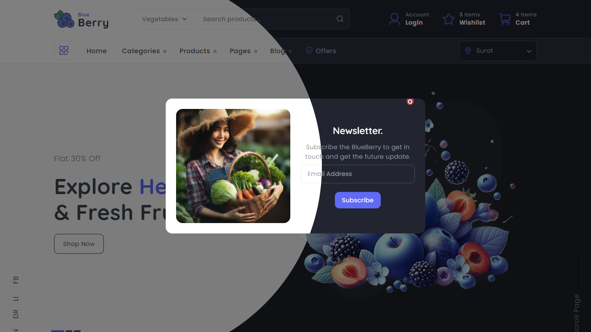
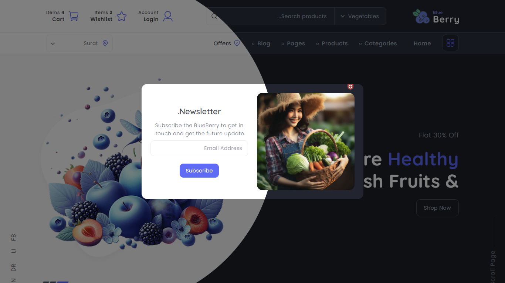

# Blue Berry - V2

Hi, I'm **Mohammad Taher** and this is my new **template** for all websites. 🚀

## Features

Some features in this template:
- This template can be used in **RTL** or **LTR** mode.
- This template can be used in **Dark** or **Light** theme.
- This theme has a good **SEO** and **CommandLine** support.
- This template has 6 color themes.
- And more... 🌟

## LTR
This is the main default mode of this template, which has 2 background themes and 8 color themes. The color themes are:

- `#8118d5` (Key 1, Default)
- `#5f6af5` (Key 2)
- `#f5885f` (Key 3)
- `#32dbe2` (Key 4)
- `#3f51b5` (Key 5)
- `#f44336` (Key 6)
- `#e91e63` (Key 7)
- `#607d8b` (Key 8)
- `#5eb595` (Key 9)



## RTL
This theme is new in this template and is redesigned for **Right-to-Left (RTL)** languages, such as Arabic, Persian, etc.

This theme also has 2 background options and 8 color themes:

- `#8118d5` (Key 1, Default)
- `#5f6af5` (Key 2)
- `#f5885f` (Key 3)
- `#32dbe2` (Key 4)
- `#3f51b5` (Key 5)
- `#f44336` (Key 6)
- `#e91e63` (Key 7)
- `#607d8b` (Key 8)
- `#5eb595` (Key 9)



## Installation
To run this template, follow these steps:

1. Extract **BlueBerryvN.N.N.zip** (for example, v2.0.0.1).
2. Configure the JS file.
3. Run **index.html** in your browser.

## Configure JS File

When you see the following code in `./assets/js/main.js`:

```js
/* Main JS */

// Selective Options
Color = 1;        // Color can be 1 to 9
rtl = true;       // true for RTL, false for LTR
dark = false;     // true for Dark Theme, false for Light Theme
BorderRadius = true; // Set to false to customize in CSS
// ...
```
